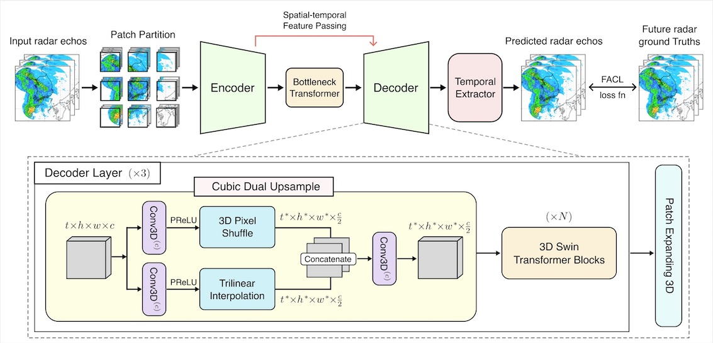
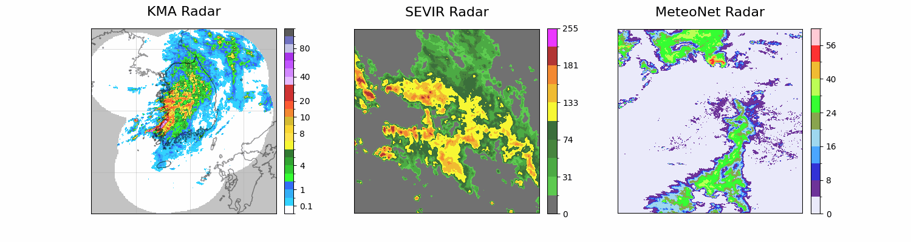

# exPreCast


## Introduction
**exPreCast** (**ex**treme **Pre**cipitation now**Cast**ing) is a high-efficiency deep learning framework designed for **extreme precipitation nowcasting**, with a particular focus on **local precipitation pattern prediction**. Extreme rainfall and storm events present substantial challenges for real-time forecasting due to their strong spatial locality, fine-scale radar structures, and variability across forecasting horizons. While recent diffusion-based generative ensembles have shown impressive capability in handling extreme events, their computational cost makes them impractical for operational nowcasting. In contrast, existing deterministic models are fast but tend to be biased toward normal rainfall, limiting their robustness in real-world applications.

To address these challenges, **exPreCast** introduces an efficient deterministic architecture that achieves both **fine-grained radar forecast quality** and **computational practicality**. The model is built around three key components:
* **Local Spatiotemporal Attention** — strengthens the model’s ability to capture localized rainfall dynamics across space and time.
* **Texture-Preserving Cubic Dual Upsampling Decoder (CDU)** — reconstructs high-resolution radar fields while maintaining fine-scale precipitation texture.
* **Temporal Extractor for Flexible Forecast Horizons** — enables adaptive and extensible prediction lengths for different nowcasting scenarios.

Alongside the model, we also provide a newly curated, **balanced KMA radar dataset** containing both ordinary and extreme precipitation events, addressing the skew commonly found in prior benchmark datasets.

Experiments on **SEVIR**, **MeteoNet**, and the balanced **KMA** dataset demonstrate that exPreCast achieves **state-of-the-art deterministic performance**, consistently delivering accurate, sharp, and reliable nowcasts across both normal and extreme rainfall regimes.


## Installation
We recommend using Conda to create an isolated environment for running exPreCast.

1. Create and activate a Conda environment
```
conda create -n exprecast python=3.10 -y
conda activate exprecast
```

2. Install PyTorch (GPU) with the appropriate CUDA version (e.g., CUDA 12.1):
```
pip install torch torchvision torchaudio --index-url https://download.pytorch.org/whl/cu121
```

3. Install remaining dependencies
```
pip install -r requirements.txt
```

## Dataset


We benchmark **exPreCast** on three different radar datasets: KMA, SEVIR, and MeteoNet. Each dataset represents distinct rainfall characteristics:
* **KMA** – a balanced dataset covering a wide spectrum of rainfall events, from ordinary to extreme.
* **SEVIR** – focused on extreme heavy rainfall events, useful for testing model performance under severe conditions.
* **MeteoNet** – biased towards normal rainfall events, suitable for evaluating performance on typical precipitation patterns.

For instructions on downloading and processing these datasets, please refer to this [Github repository](https://github.com/tony890048/Processing-Radar-Datasets).


## Training
You can start training **exPreCast** via ```train.py``` by running:
```
python train.py --dataset KMA --gpu_id 0,1,2,3
```
Additional configurable options are available in ```config.py```, allowing you to adjust hyperparameters, dataset selection, training schedule, and more.


## Checkpoints
You can download the pre-trained weights of exPreCast for each dataset through the following links:
* [KMA checkpoint](https://drive.google.com/file/d/1jIEPkalVzHP2OBAH5hqK3E5TfDCI79we/view?usp=sharing)
* [SEVIR checkpoint](https://drive.google.com/file/d/1dgeFuW4yHOPV5Il6n3IXzelOWV5iANvG/view?usp=sharing)
* [MetoeNet checkpoint](https://drive.google.com/file/d/1B7_kNeBhCTCg_7PPow67Nl1ix8xhL1rz/view?usp=sharing)

After downloading, you can load the pretrained weight by calling the function ```load_pretrained``` in the model. For example,
```
model = exPreCast()
model.load_pretrained('pretrained_kma.pth')
```

